# Story

## 160,000 calls for service a year: How women are struggling with domestic violence in California 
> For the past two decades, women have been disproportionately susceptible to domestic violence related homicides, according to California Department of Justice data. Many of them fell in love with the hopes of a “happily-ever-after.” Instead, they had to go through a storm that they had never seen coming. 

_Junyao Yang_
_May 4, 2022_

Michelle started to notice something unsettling in the person she fell in love with initially. 

When his sister called him after a fight with her partner, he would grab the gun and storm out right away. He would call his friend for an hour and curse the whole time. She realized when she was around him, she felt tense with anxiety and fear. 

Then came that day. They were in the kitchen, fighting over the money he owed her mom. He grabbed a wok and bang it against the table. She ran to the bedroom, trying to call the police. He snatched her cell phone and hung up. She asked him to give her phone back.

“Why would I? I paid for everything in the house. It’s all mine!” He said. 

“I just want to run away. I want separation in every possible sense,” Michelle said. 

Michelle is one of many women living in California who have gone through domestic violence. Many of them fell in love with the hopes of a “happily-ever-after.” Instead, they had to go through a storm that they had never seen coming. 

In California, law enforcement agencies have received more than 160,000 calls for service that are related to domestic violence in 2020, data released by the California Department of Justice shows. 87 victims have died due to domestic violence, with 80% of them women.   

For the past two decades, women have been disproportionately susceptible to domestic violence related homicides, according to California Department of Justice data. Every year from 2001 to 2020, most domestic violence related homicide victims are women. In 2013, the percentage is as high as 93%. 

[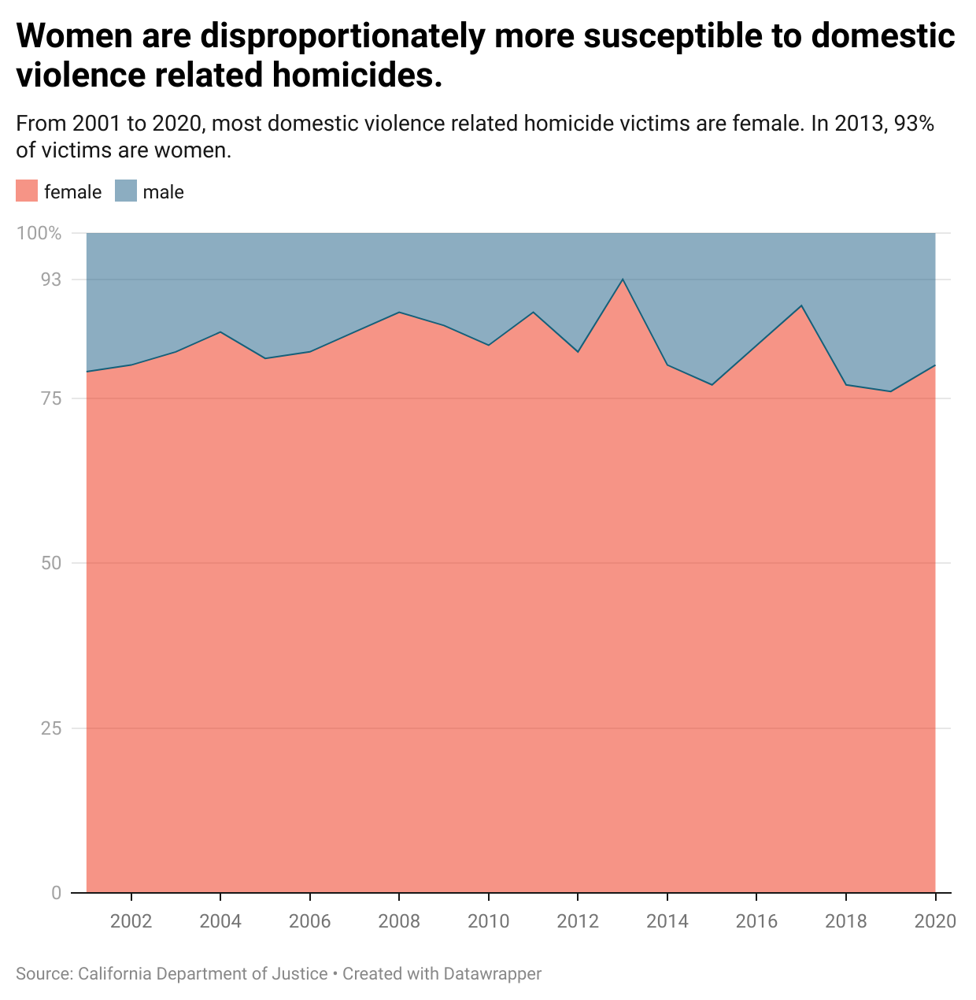](https://www.datawrapper.de/_/ayrvU/)

For a woman, the most dangerous place for her is not out in the wild, but in her own home, where one would assume she feels the safest. More than 70% domestic violence related homicide cases happen in the victim’s own residence or a shared residence with someone else, likely the offender, data shows. 

People of color and those coming from an immigrant background could also be more vulnerable when it comes to abuse. More than 33% of domestic violence related homicide victims from 2001 to 2020 are Hispanics or Latinos. 17% are black. Nearly 9% are Asian.  

Not every survivor wants to file a criminal case against their partner, especially for those who don’t have much trust in law enforcement, which means this data likely only shows the tip of an iceberg. Many survivors who are abused by their partners never called the police for help. 

Law enforcement also has a history of not taking domestic violence calls seriously enough. In the 1980s, it was common policy to delay response to domestic violence calls in the hopes that the problem would resolve itself, an early [study](https://www.ojp.gov/pdffiles1/nij/grants/215915.pdf) funded by the U.S. Department of Justice shows. 

When the abuse is not physical, it’s even harder for survivors to prove to the law enforcement or the legal system that the abuse did happen. For immigrant survivors, language is the biggest barrier that stops them from telling their stories. 

Alexis Bagon, a staff attorney at Asian Pacific Islander Legal Outreach, who works with domestic violence survivors, pointed out that it’s extremely difficult for people who don’t have the language accessibility to prove and talk extensively about their experiences of domestic violence.

“Basically you have to say all the worst things that ever happened to you, in very clear detail, with great memory and corroboration," Bagon said.

While most counties in California are receiving fewer domestic violence calls over the past two decades, some smaller counties are seeing an increase in the calls for service related to domestic violence. In Del Norte county, the far northwest corner of California, the average number of calls related to domestic violence per 100,000 population between 2011-2020 has increased near 5 times compared to 2001-2010. 

[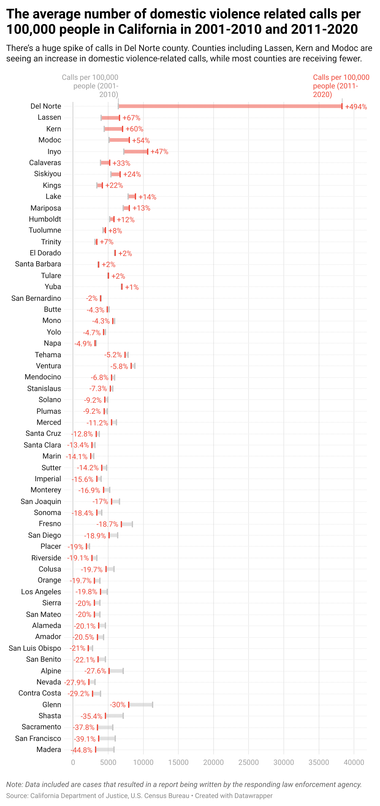](https://www.datawrapper.de/_/83EsV/)

In rural areas, domestic violence victims have limited resources to seek help. In California, 93 identified domestic violence programs across California served 5591 victims in one day, providing emergency shelter, housing advocacy and educational services. 984 requests for service went unmet due to the lack of resources, according to a report published by National Network to End Domestic Violence in 2021. 

[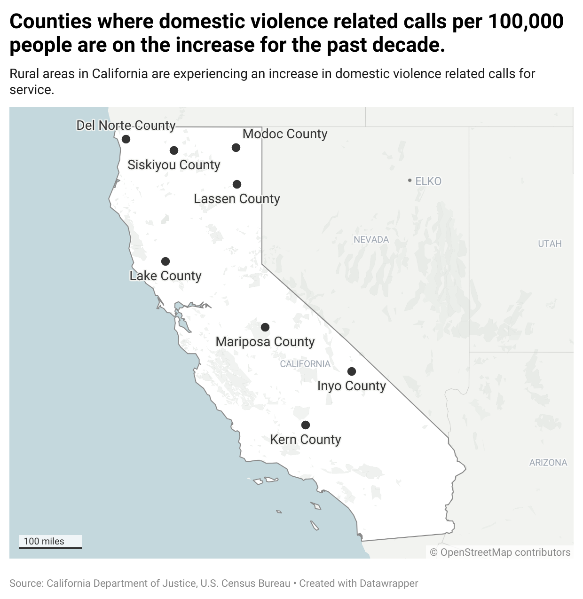](https://www.datawrapper.de/_/NbYDL/)

Even for advocacy groups, fighting to provide services to survivors is not easy either. For example, sometimes organizations struggle to make sure the survivors get help immediately in their own language when they call, said Jasmeen Kairam, the Capacity Building Coordinator at California Partnership to End Domestic Violence.

“It could go from anywhere within the day to three days, to get a call back,” said Kairam. “It’s really, really discouraging for folks, especially when they are in crisis. But we have to work with what we have, unfortunately.”

Nearly two years since the day Michelle escaped from the house and decided to never go back, she has been living in a transitional shelter and is going to move out in a couple of months. She was so anxious about leaving the shelter that she has to take anti-depressants to help her sleep. 

But now she feels better. She has been posting resources such as applying for benefits and going back to school on social media, hoping to help more survivors to get back on their feet. 

“It’s just too hard,” Michelle said. “But at least now I feel free.” 

# Data Analysis
## Dataset:
### Domestic violence related homicides
1. Download homicide-actuals data from [https://openjustice.doj.ca.gov/data](https://openjustice.doj.ca.gov/data) (84365 rows) 
2. Import to google sheets [https://docs.google.com/spreadsheets/d/16IzkOG\_wi1r0BWCIKgYMjOMdH9QEJOcNTKF-Bct93So/edit?usp=sharing](https://docs.google.com/spreadsheets/d/16IzkOG_wi1r0BWCIKgYMjOMdH9QEJOcNTKF-Bct93So/edit?usp=sharing) (Name: Homicide _Actuals_1987-2020)
3. Make a copy
### Domestic violence related calls for service
1. Download Domestic violence related calls for service data from [https://openjustice.doj.ca.gov/data](https://openjustice.doj.ca.gov/data) (165878 rows)
2. Import to google sheets [https://docs.google.com/spreadsheets/d/1OxZJbG1EetmLxCoSk3Ap5JHXOpQNrvL7ImAmLvNS8UE/edit?usp=sharing](https://docs.google.com/spreadsheets/d/1OxZJbG1EetmLxCoSk3Ap5JHXOpQNrvL7ImAmLvNS8UE/edit?usp=sharing)
3. Make a copy

## Data Cleaning and Filtering
### homicide data set
1. Import “Homicide _Actuals_1987-2020” to OpenRefine (84365 rows)
2. Trim all whitespace
3. Transform “Total Victim” and “Total Suspect” to numbers
4. Create text facet on the “county” column
	1. Change the county code to 2-digit (eg. 1 to 01)
	2. Eventually we come down to 58 counties
5. Create text facet on the “Jurisdiction (NCIC)” column
	1. Change the NCIC code to 4-digit (eg. 900-0900) by using Edit cells - Transform - Expression: `"0000"[0,4-length(value)] + value`
6. Create text facet on the columns, according to the [data dictionary](https://data-openjustice.doj.ca.gov/sites/default/files/dataset/2021-06/Homicide%20Context_062921.pdf):
	1. Change “Age” to 2-digit 
	2. Change “Victim/Offender Relationship #1” to 2-digit
	3. Change “Victim/Offender Relationship #2” to 2-digit
	4. Change “Victim/Offender Relationship #3” to 2-digit
	5. Change “Victim/Offender Relationship #4” to 2-digit
	6. Change “Means of death” to 2-digit
	7. Change “Location” to 2-digit
	8. Change “Precipitating Event” to 2-digit
	9. Change “Special Circumstances” to 3-digit
7. Create a column named “ID” to combine NCIC code and BCS number to create a unique case number (because some cases in different counties can have the same BCS number, but the NCIC code would be different.) 
	1. Use formula: =CONCAT(C2,D2) 
	2. Cope the column and paste values only
8. Create filter to narrow the data set down to homicides related to intimate partner violence between 2001-2020. I include cases where: 
	1. Precipitating Event = 62, AND:
	2. Year of Report = 2001-2020
9. Export the csv. file and Import to google sheets. Name it [CLEAN_Homicide-Actuals-2001-2020-csv ](https://docs.google.com/spreadsheets/d/1HQQCQ9QQ6IHLuy5SfWrFYghetdZuaP7LoQbt41HJpIE/edit?usp=sharing)(2583 rows)
### DV calls data set
1. In the “COUNTY” column, everything is written as XX County, but I just want the name of the county. So I split the column with the separator “County”. Now I have only the county names. 
2. Import the data set into OpenRefine, it looks clear. 
3. Export the csv. file and import to google sheets. Name it [CLEAN_DVcalls2001-2020 ](https://docs.google.com/spreadsheets/d/1OxZJbG1EetmLxCoSk3Ap5JHXOpQNrvL7ImAmLvNS8UE/edit?usp=sharing)

## Change code to words
Since the Homicide data set used a lot of codes to represent information, I want to use VLOOKUP and the [data dictionary](https://data-openjustice.doj.ca.gov/sites/default/files/dataset/2021-06/Homicide%20Context_062921.pdf) provided to transfer the code to its meaning. 
For example, in the “County” column, we can see county code instead of the name of the counties. 
### Steps: 
1. Create a new column named “County”, name the old column “Countycode”
2. Find the county code dictionary and save it as a sheet in the data set. 
3. Use VLOOKUP formula: =VLOOKUP(A2,'County Code'!A:B,2,false)
4. Copy the new column and paste values only.
### Do the same to these columns: 
- Gender
- Race/Ethnicity
	- I created another column called “W_Race/Ethnicity”_ to document the wider categories of race & ethnicity (eg. Combine Chinese, Vietnamese, Japanese into Asian)
- Victim/Offender Relationship #1
- Victim/Offender Relationship #2
- Victim/Offender Relationship #3
- Victim/Offender Relationship #4
- Means of death
- Location
- Precipitating Event
- Special Circumstance

We can see the information (instead of the codes) now. 
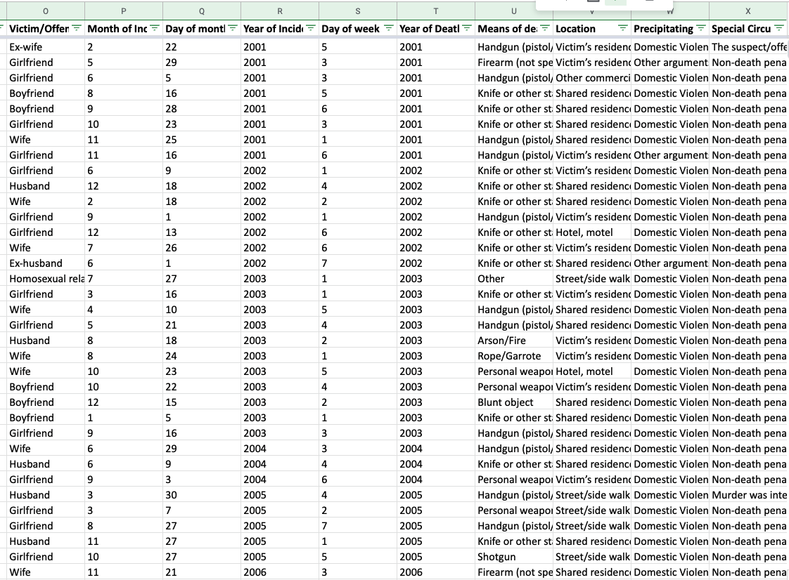

## Data questions
**Question 1: How many domestic violence related homicide cases happen in California every year from 2001 to 2020? What’s the gender distribution of victims?**
1. On the [CLEAN_Homicide-Actuals-2001-2020-csv ](https://docs.google.com/spreadsheets/d/1HQQCQ9QQ6IHLuy5SfWrFYghetdZuaP7LoQbt41HJpIE/edit?usp=sharing) data set, create a pivot table.
2. Set the rows to “Year of Report” and values “ID”. The values should be summarized by COUNTUNIQUE. It looks like this: 

3. Set the rows to “Year of Report”, set the columns to “Gender” and set values to “ID”. The values should be summarized by COUNTA. Show values as % of row. It looks like this:
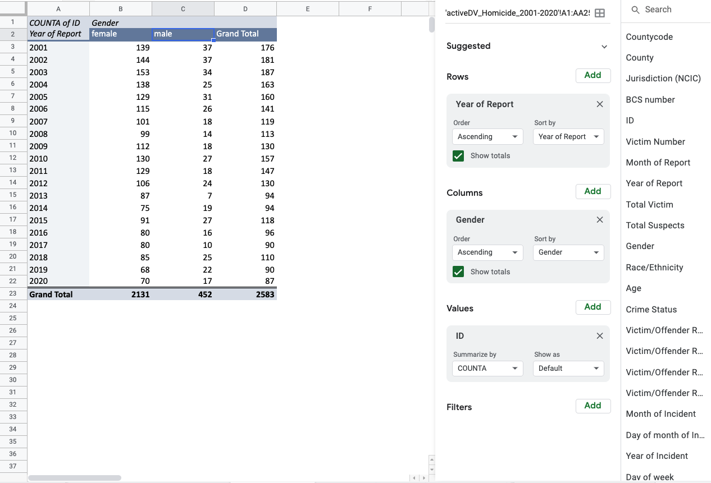
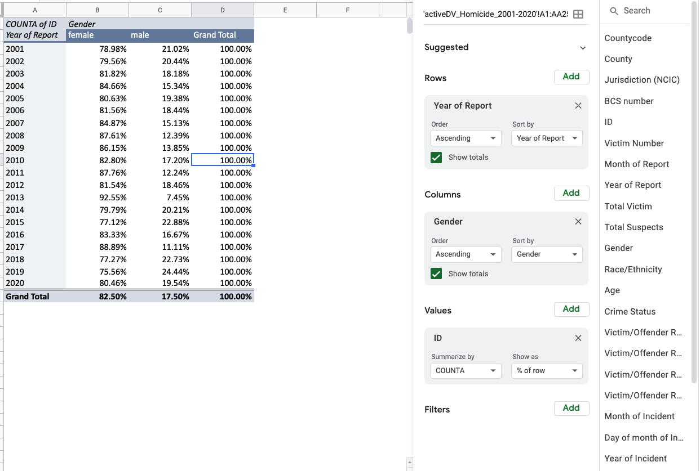
4. Finding: There are 2527 homicide cases related to domestic violence. 2583 victims are involved. Women are disproportionately the majority of victims. 

**Question 2: What’s the racial distribution of the victims?**
1. On the [CLEAN_Homicide-Actuals-2001-2020-csv ](https://docs.google.com/spreadsheets/d/1HQQCQ9QQ6IHLuy5SfWrFYghetdZuaP7LoQbt41HJpIE/edit?usp=sharing) data set, create a pivot table.
2. Set the rows to “W_Race/Ethnicity”_ and values “ID”. The values should be summarized by COUNTA. Show as % of column. Sort rows by COUNTA of ID in descending order. It looks like this: 
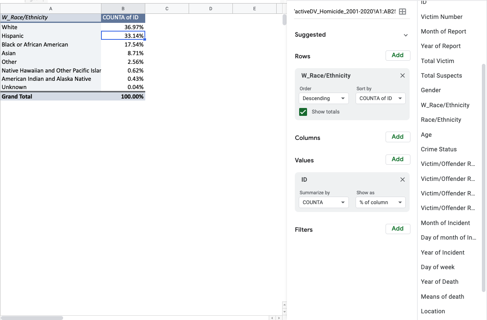
3. Finding: More than 33% of domestic violence related homicide victims are Hispanics/Latinos. 17% are black. Nearly 9% are Asian. 

**Question 3: What are the locations where victims are mostly likely to be assaulted?**
1. On the [CLEAN_Homicide-Actuals-2001-2020-csv ](https://docs.google.com/spreadsheets/d/1HQQCQ9QQ6IHLuy5SfWrFYghetdZuaP7LoQbt41HJpIE/edit?usp=sharing) data set, create a pivot table.
2. Set the rows to “Location” and values “ID”. The values should be summarized by COUNTA. Show as % of column. Sort rows by COUNTA of ID in descending order. It looks like this: 
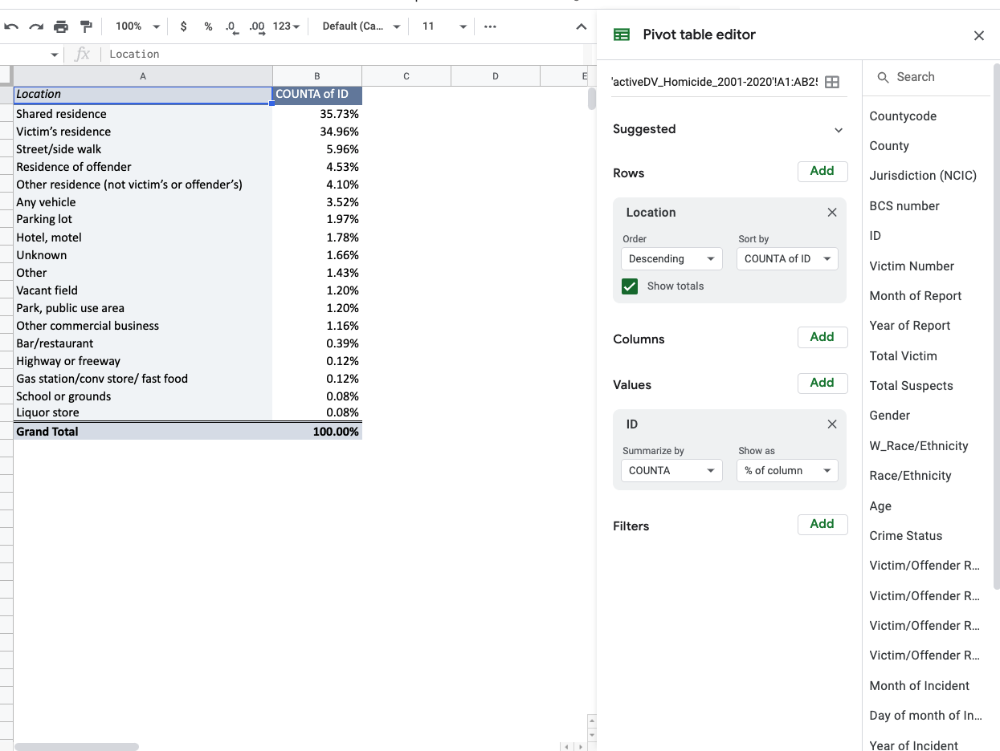
3. Finding: For a woman, the most dangerous place is not out in the wild, but her own home, where she is supposed to feel the safest. More than 70% domestic violence related homicide happen in the victim’s own residence or her shared residence with someone else, likely the offender. 

**Question 4: How many domestic violence calls for service are received by each county in first decade and the second one between 2001-2020? Combine census population data, count the number of calls per 100,000 people.**
1. On the [CLEAN_DVcalls2001-2020 ](https://docs.google.com/spreadsheets/d/1OxZJbG1EetmLxCoSk3Ap5JHXOpQNrvL7ImAmLvNS8UE/edit?usp=sharing)data set, create a pivot table.
2. Set the rows to “COUNTY” and values “TOTAL_CALLS”. The values should be summarized by SUM. Sort rows by SUM of TOTAL_CALLS in descending order. Filter YEAR to 2001-2010, 2011-2020 respectively. It looks like this: 
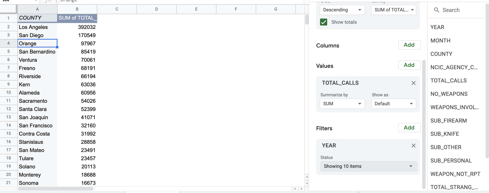
3. Copy and paste the pivot table into another sheet, name it “decade change.” It looks like this: 
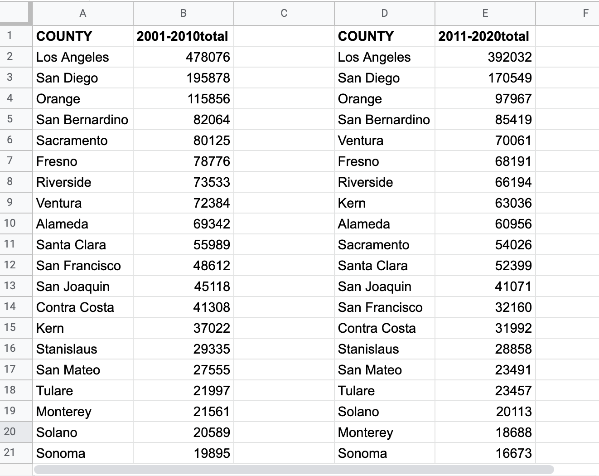
4. Use VLOOKUP to combine the two tables into one. `=VLOOKUP(A2,F:G,2,false)` Cope and paste values only. 
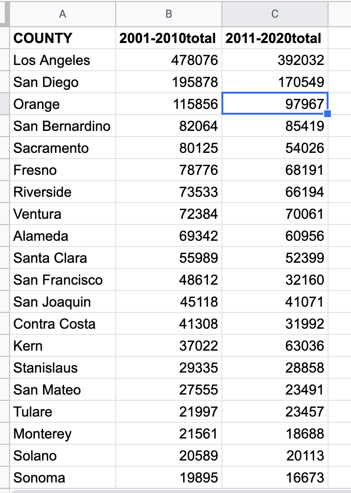
5. Download [2010](http://census.ire.org/data/bulkdata.html?state=06&sumlev=050) and [2020](https://censusreporter.org/data/table/?table=B01001&geo_ids=04000US06,050%7C04000US06&primary_geo_id=04000US06#valueType%7Cestimate) census data on population in California counties. Paste them in a new sheet named “population.”
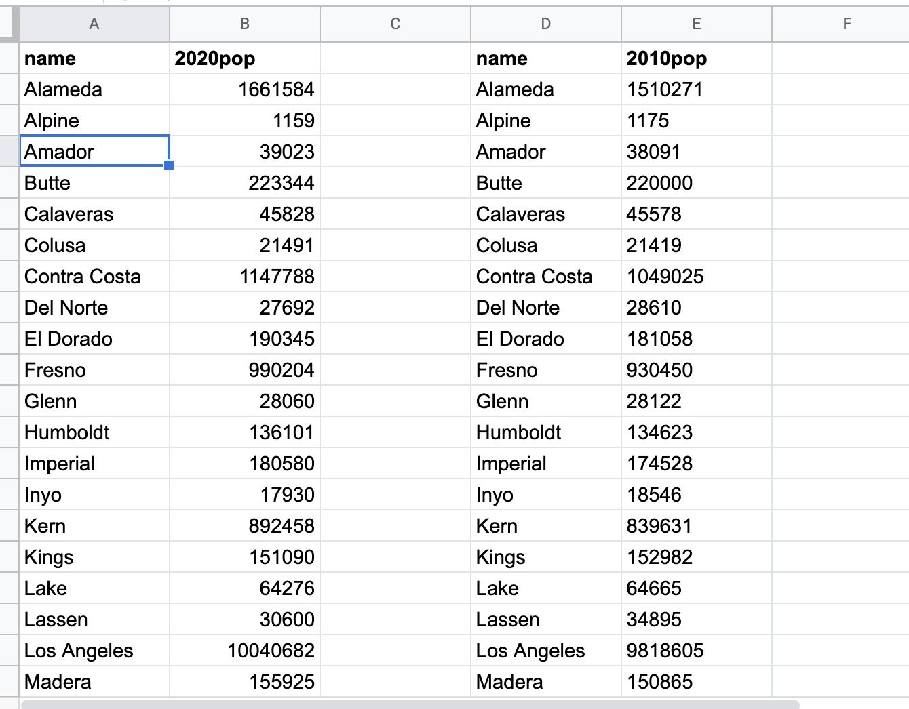
6. Use VLOOKUP to combine the population sheet together with the decade change sheet. Copy and paste values only.`=VLOOKUP(A2,population!A:B,2,false)`
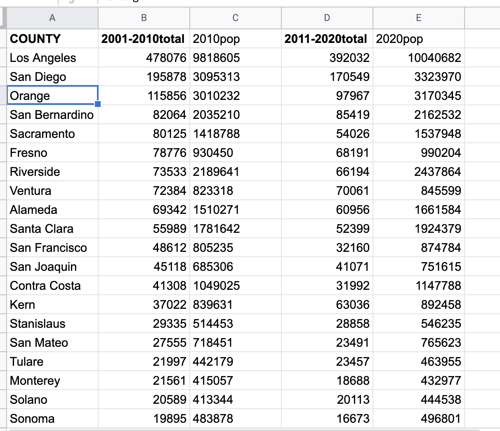
7. Calculate the number of calls per 100,000 people. `=B2/C2*100000` Copy and paste values only. Now we have a number we can compare. 
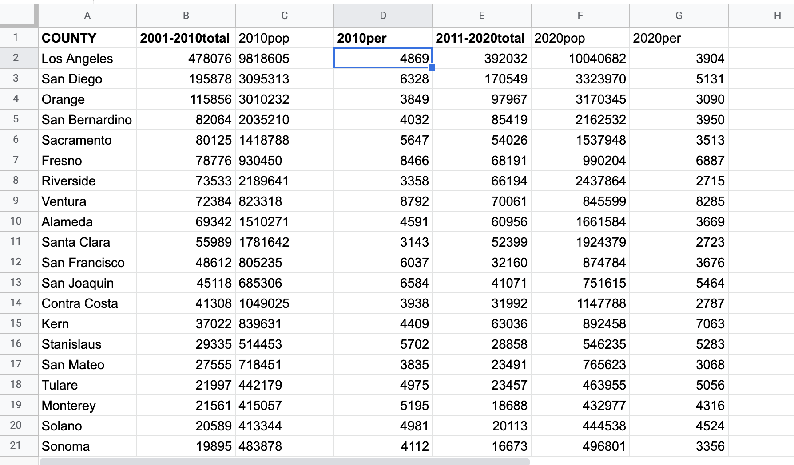
8. Finding: There’s a huge spike of calls per 100,000 people in Del Norte county. While most counties are receiving fewer domestic violence calls, Kern, Lake, Siskiyou, Lassen, Inyo, Mariposa and Modoc county are seeing increase in domestic violence related calls. 

**Question 5: What is the average age of male and female victims?**
1. On the [CLEAN_Homicide-Actuals-2001-2020-csv ](https://docs.google.com/spreadsheets/d/1HQQCQ9QQ6IHLuy5SfWrFYghetdZuaP7LoQbt41HJpIE/edit?usp=sharing)data set, create a pivot table.
2. Set the rows to “Age” and values “ID”. The values should be summarized by COUNTA. Filter Gender to male and female respectively. Create filter to exclude Age = 00 and Age = BB. It looks like this: 
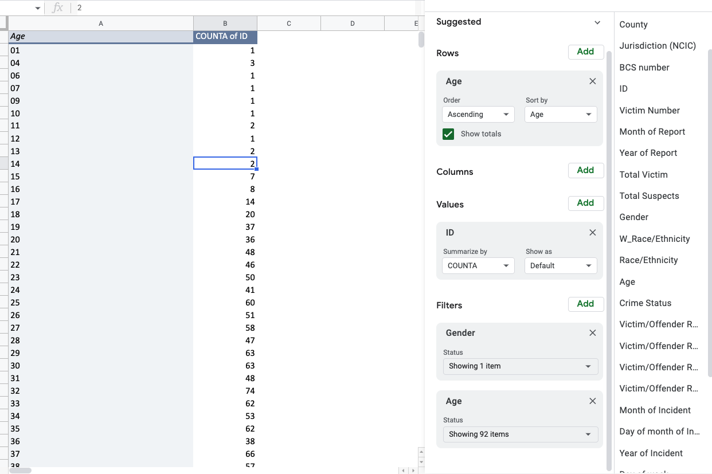
3. Copy and paste values only to another sheet named “age.”
4. Calculate the weighted average of both female and male age. `=SUMPRODUCT(B2:B82,C2:C82)/sum(C2:C82)`

5. Finding: the average age of female victims is slightly younger than male victims, with 40 years old for female, 42 for male.  

## Story Idea and Sourcing
### Human Sources: 
1. Alexis Bagon, staff attorney at Asian and Pacific Islander Legal Outreach
	- Email: [abagon@apilegaloutreach.org](abagon@apilegaloutreach.org)
	- She works with domestic violence survivors to apply for their green card through the Violence Against Women Act (VAWA) or helps them get a U Visa, which is a visa based on being the victim of a crime. Talking to her has provided me with a lot of context regarding domestic violence. 
2. Jasmeen Kairam, Capacity Building Coordinator at California Partnership to End Domestic Violence
	- Email: [jasmeen@cpedv.org](jasmeen@cpedv.org)
	- Kairam works at California Partnership to End Domestic Violence, which represents over 1,000 survivors, advocates, organizations and individuals across the state. Kairam has experience working with many other domestic violence organizations in the state, which could also help me gain a better sense of the scope of the problem. 
3. Michelle, domestic violence survivor
	- Phone number
	- Michelle lives in Los Angeles with her kid. She escaped her home after having the fight with her ex-husband. Her ex-husband didn’t beat her, but there was a lot of emotional abuse. She lives in a shelter now and is about to move out. I’m really grateful that she’s willing to talk to me about such a private experience.  
### Additional Sources
1. [15th Annual Domestic Violence Counts Report](https://nnedv.org/wp-content/uploads/2021/05/15th-Annual-DV-Counts-Report-California-Summary.pdf) from National Network to End Domestic Violence (2021)
2. Law Enforcement Response to Domestic Violence Calls for Service [report](https://www.ojp.gov/pdffiles1/nij/grants/215915.pdf) funded by the U.S. Department of Justice

## Data Visualizations
1. This is a range plot chart showing the average number of domestic violence related calls per 100,000 people in California counties during the first and second decade of the 21st century. 

2. This a stacked area chart showing the gender distribution of domestic violence related homicide victims. 

